Main Link:

[UE4 Material Editor - Shader Creation](https://www.youtube.com/playlist?list=PL78XDi0TS4lFlOVKsNC6LR4sCQhetKJqs)

# 04 Distortion Shader

[Link](https://www.youtube.com/watch?v=gwx2NOZJ5CE&list=PL78XDi0TS4lFlOVKsNC6LR4sCQhetKJqs&index=4)

Extra videos:

[01](https://www.youtube.com/watch?v=yj7-h_X_eu4)

[02](https://www.youtube.com/watch?v=Q2UY8Pxl7kY)

[03](https://www.youtube.com/watch?v=sR0xV0TDvS8)

Extra resources:

[Unreal4 UV Tricks](http://www.tharlevfx.com/unreal-4-uv-tricks)

## Move Textures

TexCoord + Vec2

TexCoord + Time * Vec2

TexCoord + (Noise.x, Noise.y) * Intensity 实现材质扭曲

可以先对noise进行偏移，再通过Texcoord加到纹理上。

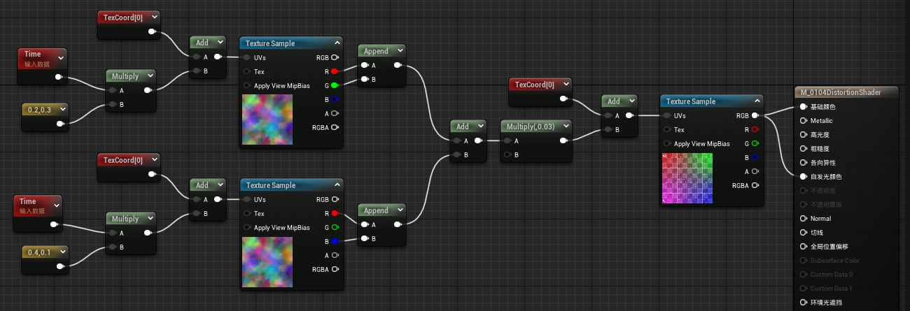

# 05 Flipbook Animation

[Link](https://www.youtube.com/watch?v=ZWAF_f2aP9s&list=PL78XDi0TS4lFlOVKsNC6LR4sCQhetKJqs&index=5)

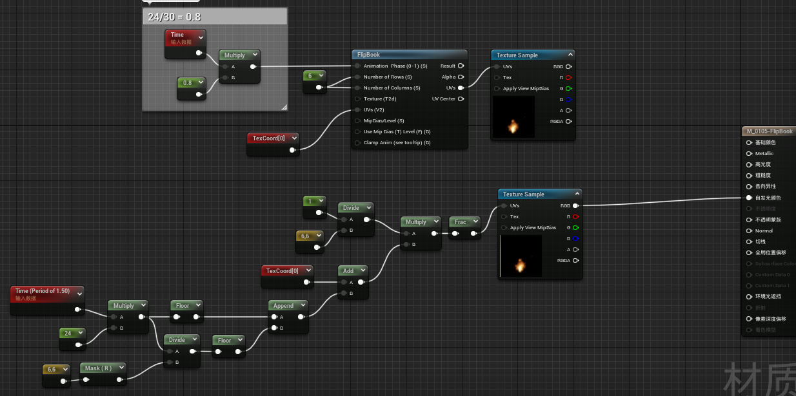

# 06 Environment Blending

[Link](https://www.youtube.com/watch?v=QwVDlS8uiYg&list=PL78XDi0TS4lFlOVKsNC6LR4sCQhetKJqs&index=6)

使用世界空间法线B通道，在模型的上方混合一个新的材质。

从法线图中提取向上方向，可以更精确地进行混合。这里需要将法线的切线空间转换到世界空间。

切线空间：UVW。UV即纹理的UV，W为垂直UV远离模型表面的方向。[Wiki](https://en.wikipedia.org/wiki/Tangent_space_)

世界空间：世界坐标的XYZ。Z为绝对的向上方向。

[UE文档，Shader向量操作](https://docs.unrealengine.com/5.1/en-US/vector-operation-material-expressions-in-unreal-engine/#transform)

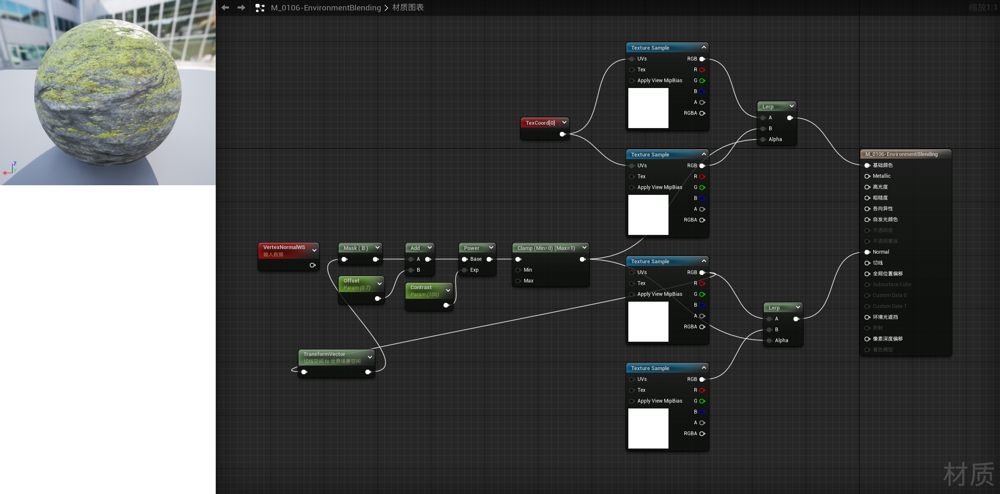

来自UE文档，将切线空间转换到查看空间(view space)制作Billboard效果。

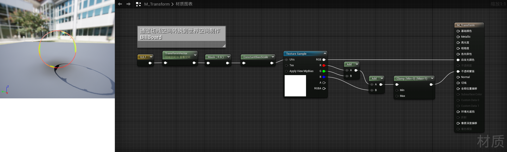

# 07 Shader Performance Optimization

[Link](https://youtu.be/D8E47BJOE6E?list=PL78XDi0TS4lFlOVKsNC6LR4sCQhetKJqs)

## 查看性能

### alt + 8

查看着色器复杂度，但只是一个概括性的表示。

### Shader instruction count

Shader Graph -> HLSL -> Assembly Instructions -> Graphics Driver

缺陷：

* 并非所有的指令消耗同样的时间。

* 不同平台需要不同的指令数量。

### Test on your target platform

实机测试，最准确的方式。

## 优化性能

### 删掉不要的东西

### 重构数学表达式

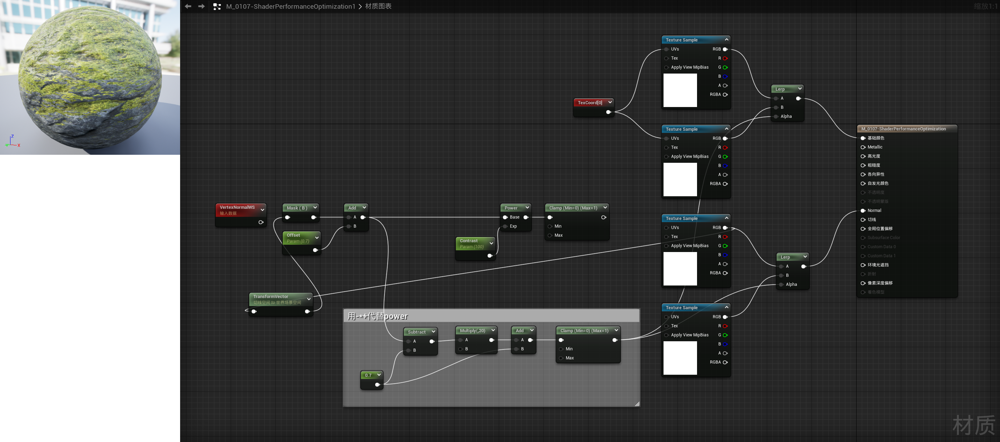

### 使用四维向量来减少重复的节点

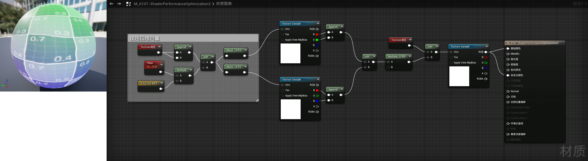

### 将多张纹理合成在一张纹理中

比如Substance Painter的ORM
 
# 08 Bump Offset and Parallax Occlusion Mapping

[Link](https://www.youtube.com/watch?v=wc0StMr3CQo&list=PL78XDi0TS4lFlOVKsNC6LR4sCQhetKJqs&index=8)

## BumpOffset

输入一张高度图，再对原有纹理采样。

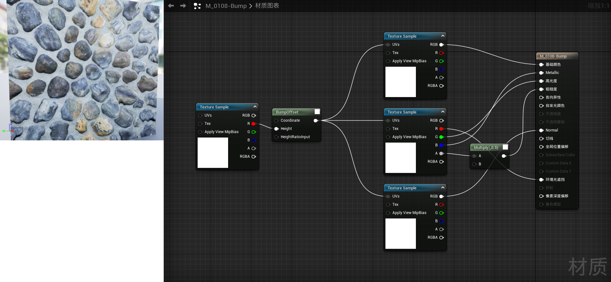

## Parallax Occlusion Mapping

输入纹理对象，高度比率，参考平面。节点采用射线对纹理进行采样。需要消耗更多的性能。

修改Min/Max Steps改变高度的精度。

# 09 Texture Compression and Settings

[Link](https://www.youtube.com/watch?v=h95X255NhOo&list=PL78XDi0TS4lFlOVKsNC6LR4sCQhetKJqs&index=9)

[DXT参考资料](http://wiki.polycount.com/wiki/DXT)

DXT1能使容量减少到1/8，DXT5能使容量减少到1/4。

Aplha压缩：只会使用Alpha通道。

如果不需要使用颜色，关闭sRGB。

# 10 Cloth Shader

[Link](https://www.youtube.com/watch?v=LUfG5ojx0O4&list=PL78XDi0TS4lFlOVKsNC6LR4sCQhetKJqs&index=10)

布料特点：

1. 针织布料的边缘有些许突起的纤维，使得有亮光

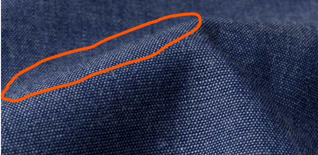

2. Satin（缎子）相反，边缘更暗。直面的区域更亮。

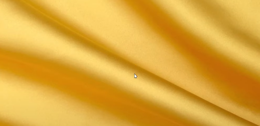

3. 丝绸同理，面向光源或摄像机的表面更亮。

[神秘海域4的布料效果](https://www.artstation.com/artwork/6kEmV)

[Siggraph的ppt](http://advances.realtimerendering.com/s2010/Hable-Uncharted2(SIGGRAPH%202010%20Advanced%20RealTime%20Rendering%20Course).pdf)，布料算法在第80页。

菲涅尔效果：相机向量点乘像素法线。像素法线可以用法线图（需要transform）。

使用菲涅尔+反菲涅尔改变边缘或中间的亮度。

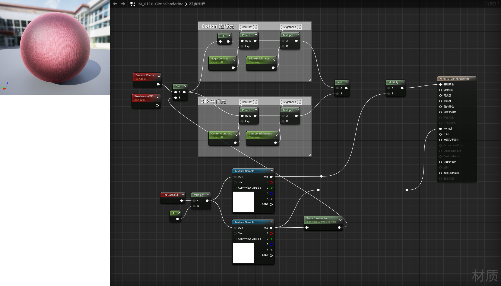

# 11 Volumetric Ice Shader

[Link](https://www.youtube.com/watch?v=X5WASspig3g&list=PL78XDi0TS4lFlOVKsNC6LR4sCQhetKJqs&index=11)

Other Resources: 

[1](https://www.artstation.com/blogs/kanoba/Ajpj/paragon-breakdown-001-ice-shader-part-i)

[2](https://80.lv/articles/developing-artistic-ice-in-unreal-engine-4/)

实现“两层”的效果：冰的表面与下面。并且“下面”位置会随着摄像机角度变化而变化。

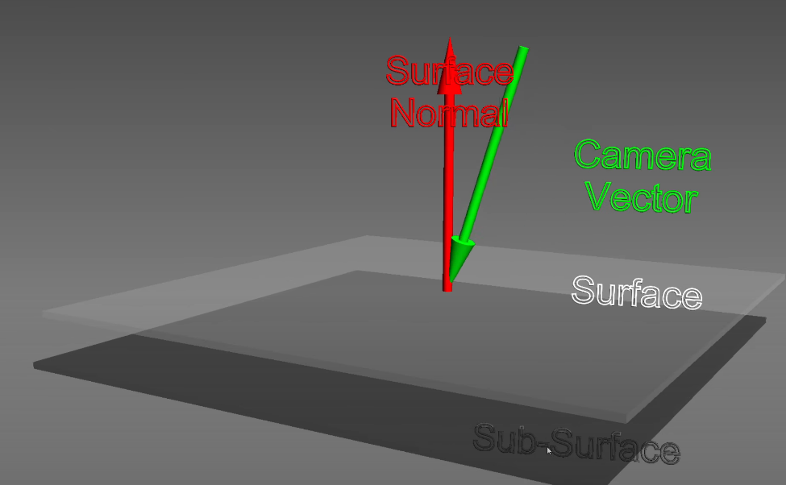

由CameraVector得到ReflectionVector，将其反向得到TransmissionVector，用来驱动UVcoord。

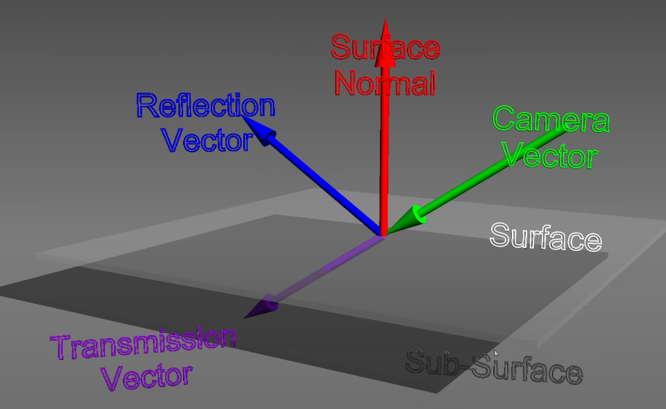

计算反射向量

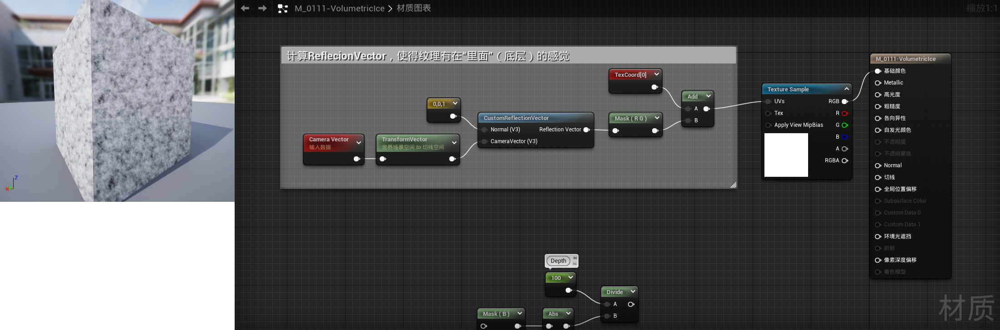

处理反射向量。用其B和材质的分辨率控制控制纹理向内凹陷的深度。

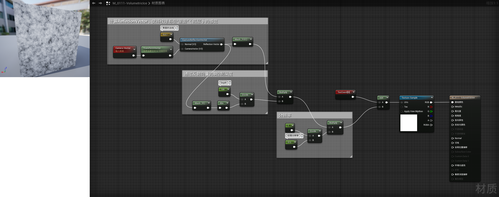

将(0, 0, 1)替换成一张法线图，可以在表面做出凹凸的效果。其次，用一张灰度图替换Depth，可以使得不同地方的凹陷程度不同。

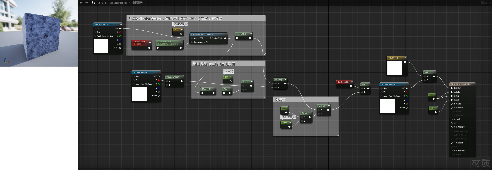

# 12 Rustling Leaves Shader 

[Link](https://www.youtube.com/watch?v=5FxaVC5w97w&list=PL78XDi0TS4lFlOVKsNC6LR4sCQhetKJqs&index=12)

使用sine+TexCoord制作扰动效果，和一张蒙版相乘，使得不同绘制区域的树叶，运动模式不同。

同时sine+Normal使得法线产生相对应扰动效果，更具有3D感。

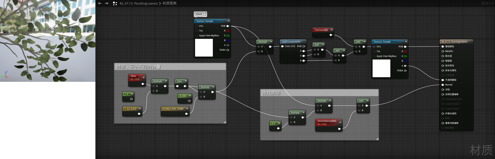

# 13 Rain Wetness Shader

[Link](https://www.youtube.com/watch?v=fYGOZYST-oQ&list=PL78XDi0TS4lFlOVKsNC6LR4sCQhetKJqs&index=13)

效果：沾水的表面会变暗，更加饱和（给Desaturation传入一个负数），粗糙度大幅降低。

这里使用了材质函数。输入原材质的BaseColor, Roughness, Specular。

补充一个水面的Mask，以及“渗透性”（Porousness，只影响颜色，值越高，色彩越潮湿）。这里将Roughness和Specular组成了Vector2进行运算。

# 14 Rain Drops Shader

[Link](https://www.youtube.com/watch?v=5eyq2FJ6lig&list=PL78XDi0TS4lFlOVKsNC6LR4sCQhetKJqs&index=14)

[制作雨滴法线图](https://www.youtube.com/watch?v=YbiX2FhmlaU)

Other Resources

[1](https://www.youtube.com/watch?v=bXEzhntMnwc)

[2](https://www.youtube.com/watch?v=ymAuk1z6f-g)

雨滴效果思路：

1. 通过改变法线（改变RG，B恒定为1）体现出雨滴。静态雨滴法线恒定，动态雨滴处的法线强度在0-1中循环。

2. 只有模型的上方才会有雨滴，使用VertexNormal(B)。

3. 雨滴的粗糙度非常低，反转雨滴法线的RG，提取出雨滴的区域。

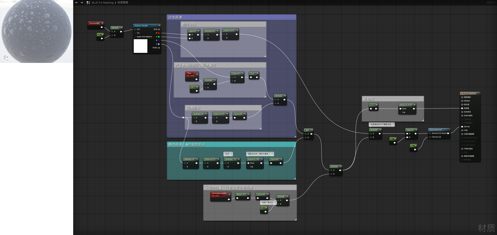

# 15 Rain Drip Shader

[Link](https://www.youtube.com/watch?v=rhlV4okjkiA&list=PL78XDi0TS4lFlOVKsNC6LR4sCQhetKJqs&index=15)

效果思路：

1. 提取出模型的侧面。

2. 使用灰度不同的竖条，改变不同位置的流水速度。

3. 使用面条状的流线，制作流水形状。

4. 用很扁的长条做蒙版，乘第3步的流水。

5. 水流处法线和粗糙度处理与14同理。

# 16 Rain Ripples Shader

[Link](https://www.youtube.com/watch?v=ABWzKYc6UQ0&list=PL78XDi0TS4lFlOVKsNC6LR4sCQhetKJqs&index=16)

Time->Frac制作从0到1不断变化的小数，-1+圆形渐变，制作向外扩散的效果。放大后传入sine，可以得到一层一层的涟漪效果。

下图中纹理的R通道储存了多个圆形渐变；A是灰度不同的圆形，使得不同位置的涟漪交替出现；GB存储了法线的XY。

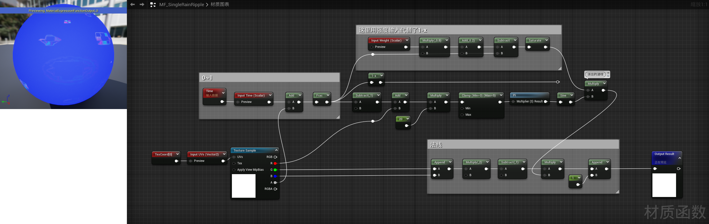

多个涟漪可以交叉叠加，所以使用不同的时间，不同的UV，不同的强度传入上图的函数，再将4个法线叠加。

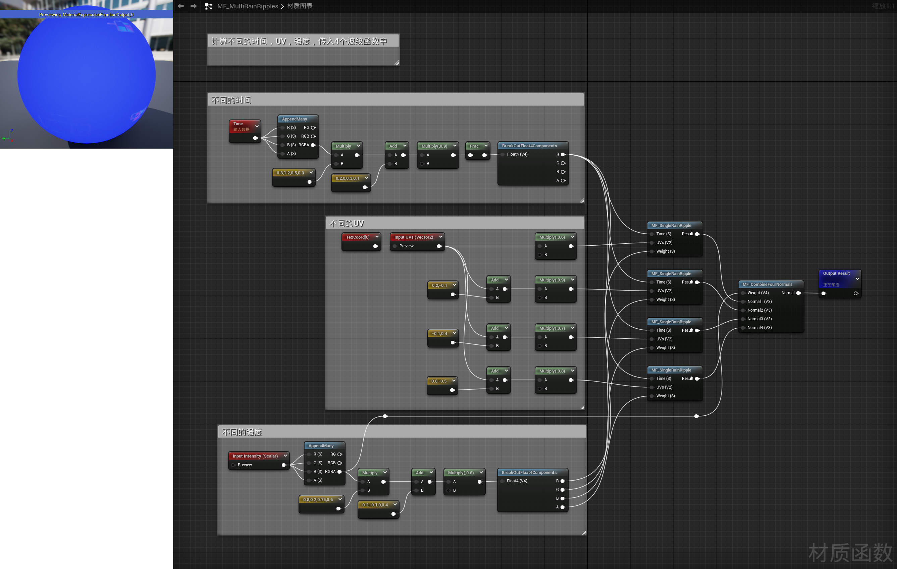

叠加函数如下。先提取所有法线的RG，乘强度后相加；提取所有法线的B，做插值处理lerp(1, B, 强度），再全部相乘。最后将处理过的RG和B组合得到输出法线。

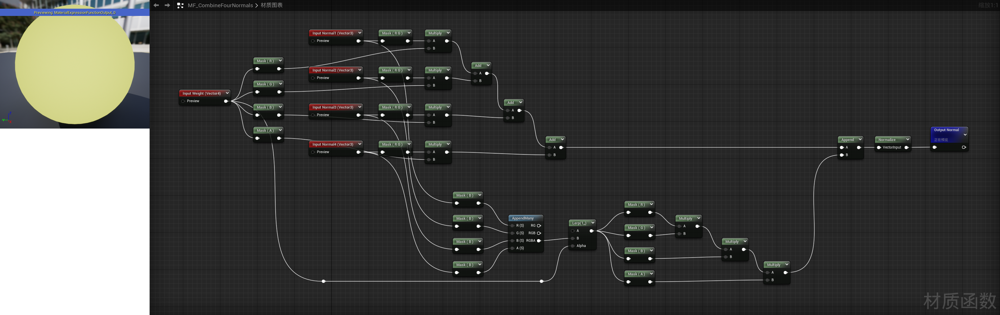

# 17 Rain Puddle Shader 

[Link](https://www.youtube.com/watch?v=7COoNjAGmAk&list=PL78XDi0TS4lFlOVKsNC6LR4sCQhetKJqs&index=17)

17就是对16的效果制作遮罩，确定涟漪产生的位置；同时在涟漪上叠加一层水面（两个水面法线叠加）的效果。

使用一张噪波，提取出需要产生水坑的地方；同时确保效果只产生在模型上方；有水坑的地方，粗糙度大幅降低。

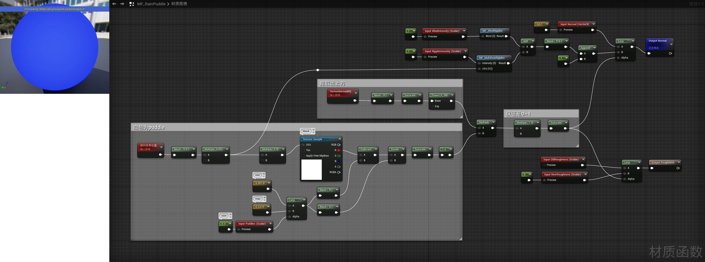

水面效果很简单，叠加两张水的法线。

叠加法线的技巧：两张纹理的RG叠加，乘强度；各自的B直接相乘；最后append。

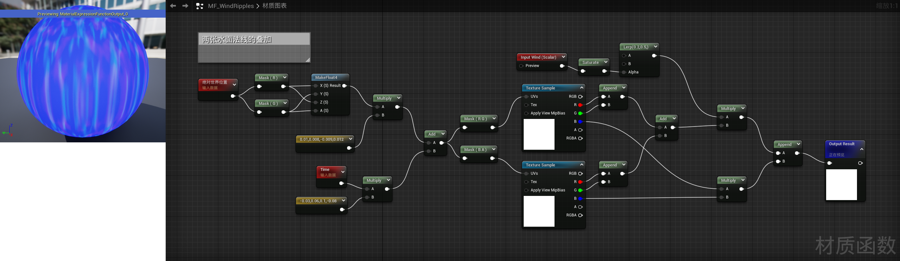

# 18 Complete Rain Shader

[Link](https://www.youtube.com/watch?v=tUemJLSaFxw&list=PL78XDi0TS4lFlOVKsNC6LR4sCQhetKJqs&index=18)

Other Resources:

[1](https://www.fxguide.com/fxfeatured/game-environments-partc/)

[2](https://80.lv/articles/setting-up-rain-materials-in-substance-designer/)

[3](https://seblagarde.wordpress.com/2013/01/03/water-drop-2b-dynamic-rain-and-its-effects/)

13~17的效果集合。

13——潮湿效果，14——雨滴，15——下雨流水，16——涟漪，17——水坑。

Wetness 潮湿

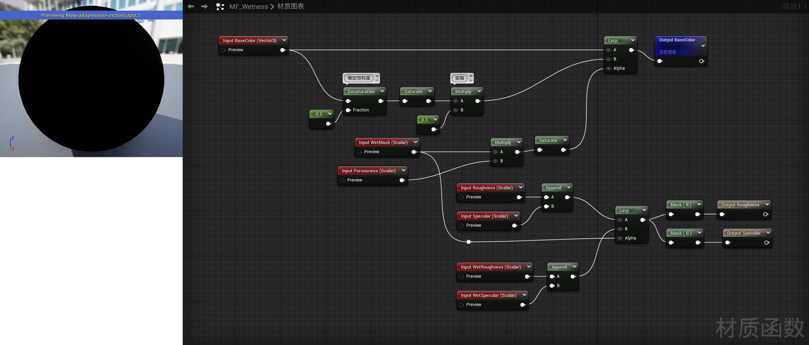

RainDrop 雨滴

RainDrip 流水

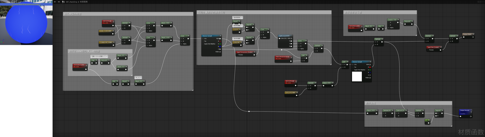

RainPuddle 水坑（包含了涟漪和水面）

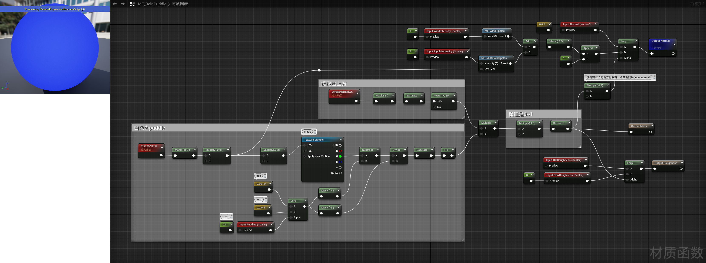

Rain 总效果

* Rain控制下雨程度，影响雨滴和流水。

* Wet控制整体的潮湿程度。

* Puddles, Wind, Ripple控制水坑，水面，涟漪。

* WetRoughness控制潮湿处的粗糙度。

* 输入原材质的BaseColor, Specular, Roughness, Normal。

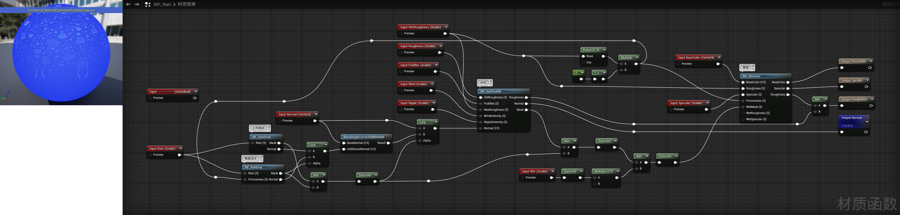

# 19 Procedural Noise

[Link](https://www.youtube.com/watch?v=QIlxWkfZK-8&list=PL78XDi0TS4lFlOVKsNC6LR4sCQhetKJqs&index=19)

程序化噪点

1. 函数：常用快速梯度-3D纹理。

2. 关卡：数量越高，细节越多，性能消耗越大。

3. 最小/最大输出：图像灰度的值。

# 20 Snowy Tree Trunk Shader

[Link](https://www.youtube.com/watch?v=dco2ra0xAcY&list=PL78XDi0TS4lFlOVKsNC6LR4sCQhetKJqs&index=20)

使用noise在树皮材质的基础上添加上雪材质。noise输入世界坐标，使用3D纹理。

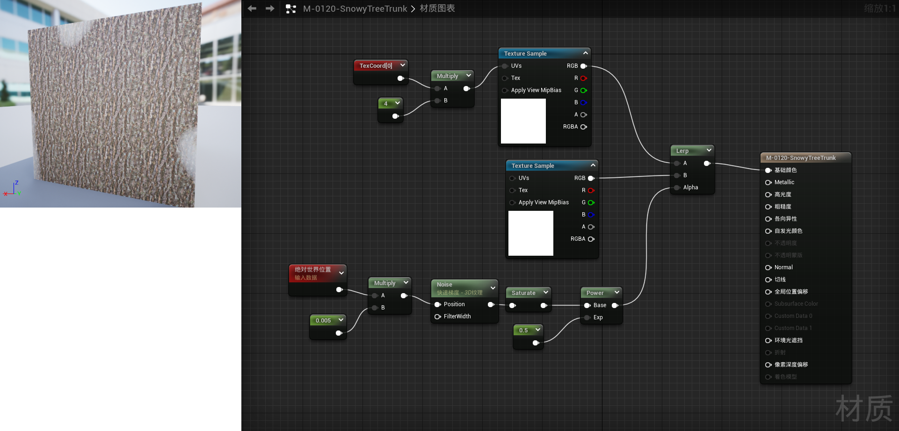

# 21 Rock Layers Shader 

[Link](https://www.youtube.com/watch?v=cGmWa-gETzU&list=PL78XDi0TS4lFlOVKsNC6LR4sCQhetKJqs&index=21)

Other Resources

[1](https://www.youtube.com/watch?v=Ymo-izZN6UI)

[2](https://www.youtube.com/watch?v=kc76I0iSUck)

使用世界坐标B使得石头在世界空间的Z轴上始终保持分层的效果；加上噪波，使得每一层之间有随机的过渡效果。

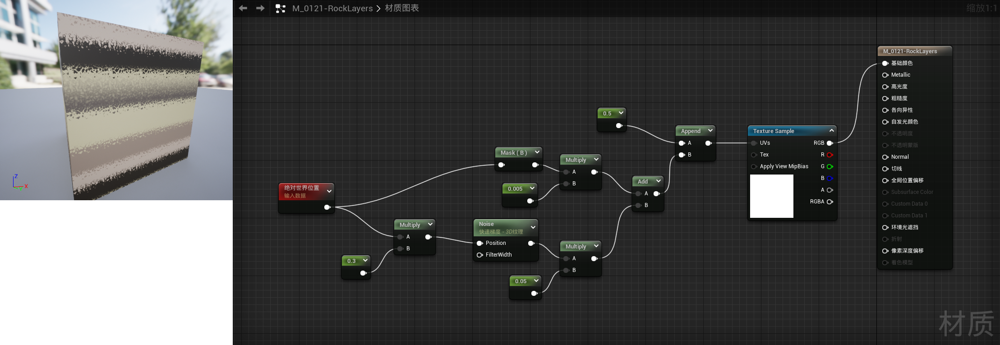

# 22 World-Aligned Textures 

[Link](https://www.youtube.com/watch?v=pXOknekvmwE&list=PL78XDi0TS4lFlOVKsNC6LR4sCQhetKJqs&index=22)

WorldAlignedTexutre节点能将纹理3D映射到XYZ平面上，不考虑模型本身的UV。

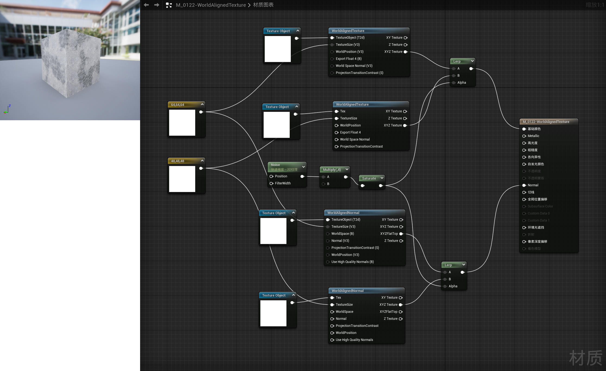

# 23 Water Ripples Shader

[Link](https://www.youtube.com/watch?v=r68DnTMeFFQ&list=PL78XDi0TS4lFlOVKsNC6LR4sCQhetKJqs&index=23)

水的特征：

1. 波纹。

2. 随深度改变颜色。浅水几乎是透明的，越深越看不清下面的东西。

3. 反射。垂直看向水面时，能看到底部；几乎平行看时，反射很明亮。

4. look through水时，波纹和涟漪使得看到的水下的物体产生扭曲形状。

关键点：

* Surface Ripples [x]

* Depth Color Gradient [ ]

* Depth Opacity [ ]

* Reflection [ ]

* Refraction [ ]

将两张水面法线进行平移并叠加。另外再叠加一张大的法线。最后还可以加上下雨效果。

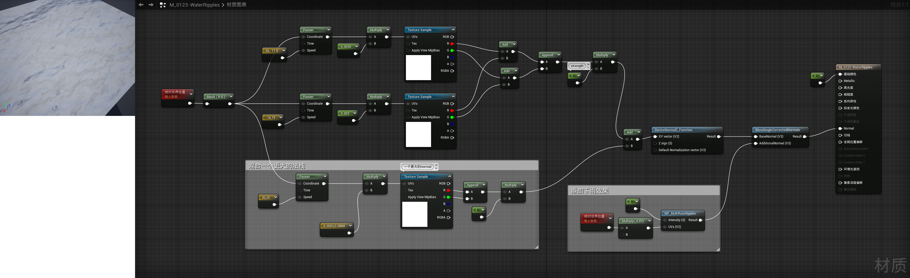

# 24 Water Depth Shader

[Link](https://www.youtube.com/watch?v=TObymSnTwV0&list=PL78XDi0TS4lFlOVKsNC6LR4sCQhetKJqs&index=24)

关键点：

* Surface Ripples [ x ]

* Depth Color Gradient [ x ]  蒙版：黑色看得清，白色看不清。

* Depth Opacity [ x ]

* Reflection [ ]

* Refraction [ ]

把上一期的材质改成半透明。

两个表示深度的节点： Scene Depth / Pixel Depth

Scene Depth表示从摄像机出发，一路到不透明物体的距离。Pixel Depth表示当前像素点到摄像机的距离

SceneDepth - PixelDepth代表看到的水面深度。

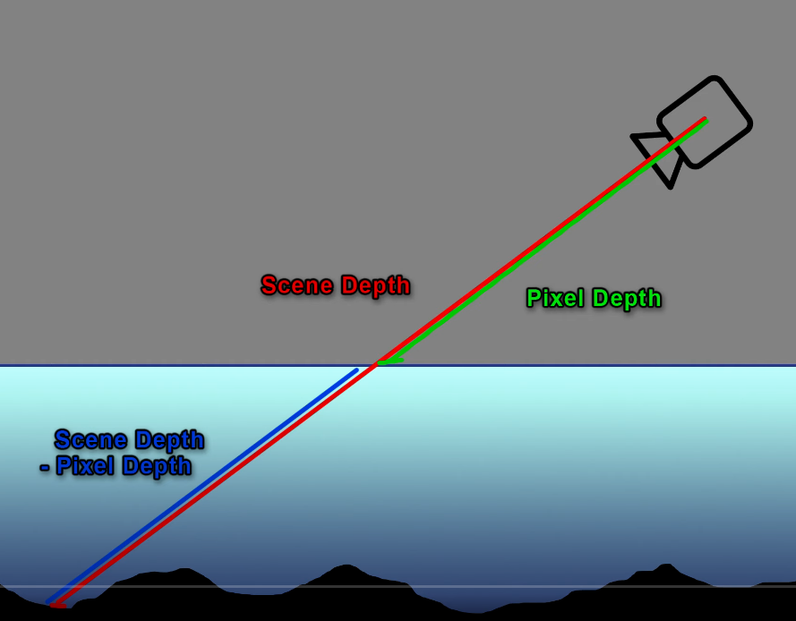

改进：真正的深度应该是水面竖直朝下的长度。

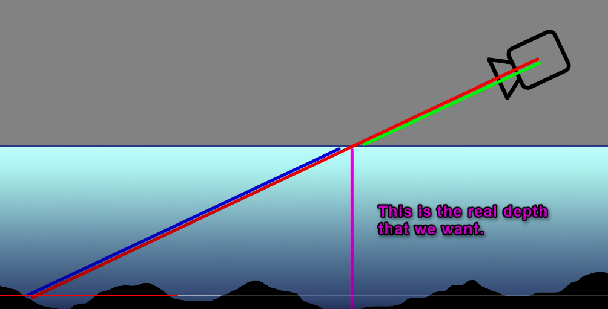

Shader里的数学分析（也许是对的）。减去水平面的世界Z相当于变换坐标系到O'。

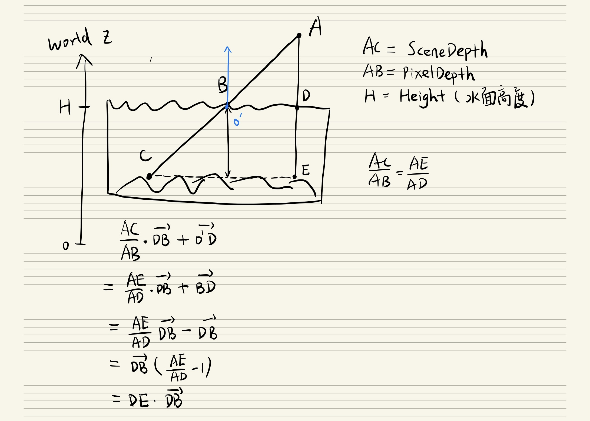

加上菲涅尔效果（加白色），越是平行看向水面，越看不清下面的东西（蒙版越白）。连入之前的法线，将PixelNormal连入菲涅尔。

修改光照模式：表面半透明体积。

乘DepthFade柔化物体与水面接触的边界。

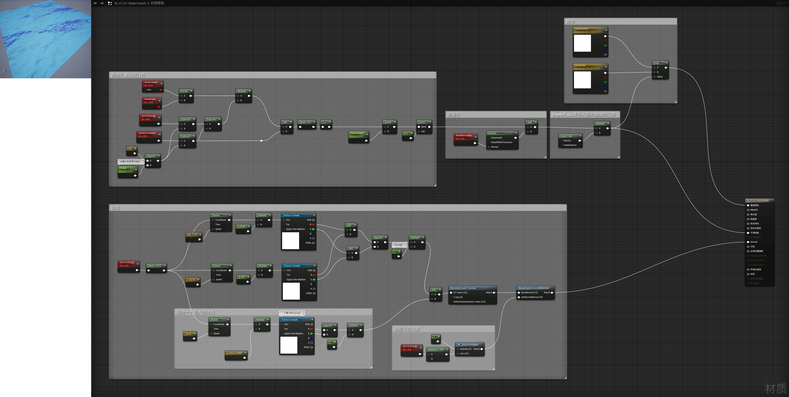

# 25 Water Reflection & Refraction Shader

[Link](https://www.youtube.com/watch?v=8-GCauULKLY&list=PL78XDi0TS4lFlOVKsNC6LR4sCQhetKJqs&index=25)

关键点：

* Surface Ripples [ x ]

* Depth Color Gradient [ x ]  蒙版：黑色看得清，白色看不清。

* Depth Opacity [ x ]

* Reflection反射 [ x ] 

* Refraction折射 [ x ]

## 反射

使用屏幕空间反射方法。SSR只能在水中显示当前屏幕中物体的反射效果。

左侧细节面板勾选“屏幕空间反射”。

## 折射

只需要输入折射率。水用1.333.

左侧细节面板：折射-折射模式-像素正常偏移。

其他公式相同。

在水面与物体接触的边缘处（DepthFade节点）做一点调整。

* 颜色插值不用经过DepthFade的结果。

* Lerp，交界处折射为1（几乎无折射）。

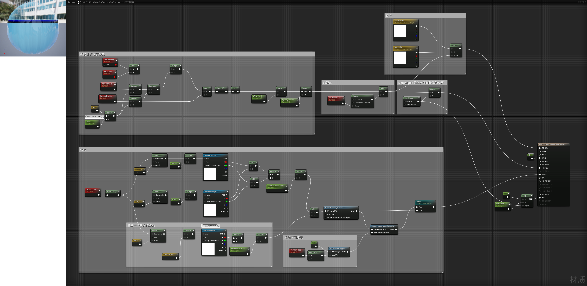

# 26 Water Gerstner Waves

[Link](https://www.youtube.com/watch?v=BJSMVvZMQ1w&list=PL78XDi0TS4lFlOVKsNC6LR4sCQhetKJqs&index=26&t=171s)

这玩意要细分，但是虚幻5把这个功能移除了。

# 27 Water Caustics 

[Link](https://www.youtube.com/watch?v=9z6EMsoqLDY&list=PL78XDi0TS4lFlOVKsNC6LR4sCQhetKJqs&index=27)

# 28 Water Foam

[Link](https://www.youtube.com/watch?v=oI_q5g3580I&list=PL78XDi0TS4lFlOVKsNC6LR4sCQhetKJqs&index=28)

# 29 Water Flow Maps

[Link](https://www.youtube.com/watch?v=9N-pQNPChxU&list=PL78XDi0TS4lFlOVKsNC6LR4sCQhetKJqs&index=29)

到25，已经有一个还可以的水效果。26~29先不看，准备看其他内容。

-----

# 30 Foliage Translucency 

[Link](https://www.youtube.com/watch?v=Tap2N0_ZBRw&list=PL78XDi0TS4lFlOVKsNC6LR4sCQhetKJqs&index=30)

太阳光透过叶子的发光效果。

材质选择“双面植物”，使用次表面颜色即可。

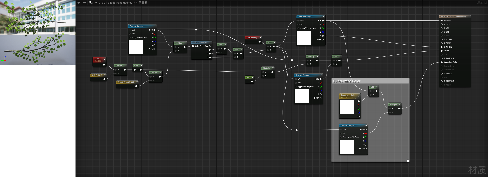

# 31 Foliage Texture Packing 

[Link](https://www.youtube.com/watch?v=MtZd1g0aKiY&list=PL78XDi0TS4lFlOVKsNC6LR4sCQhetKJqs&index=31)

如何将多张贴图组合在一起？以及如何在shader中调整灰度强度。

制作SubsurfaceColor的蒙版时，先减（除去树枝）后乘（增加树叶灰度）；粗糙度可以直接将蒙版反向，原先树叶为白色，反转后为灰色（低粗糙度）。

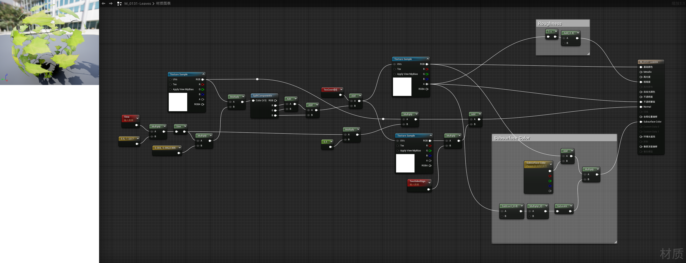

# 32 Foliage Hiding Planes

[Link](https://www.youtube.com/watch?v=U7Tg7uIeSeQ&list=PL78XDi0TS4lFlOVKsNC6LR4sCQhetKJqs&index=32)

如何让树叶少一点面片感？当摄像机向量几乎和面片法向垂直时，将其透明化即可。

这里需要用世界位置的DDX和DDY叉乘计算出三角形的面法向。因为VertexNormal会产生渐变。

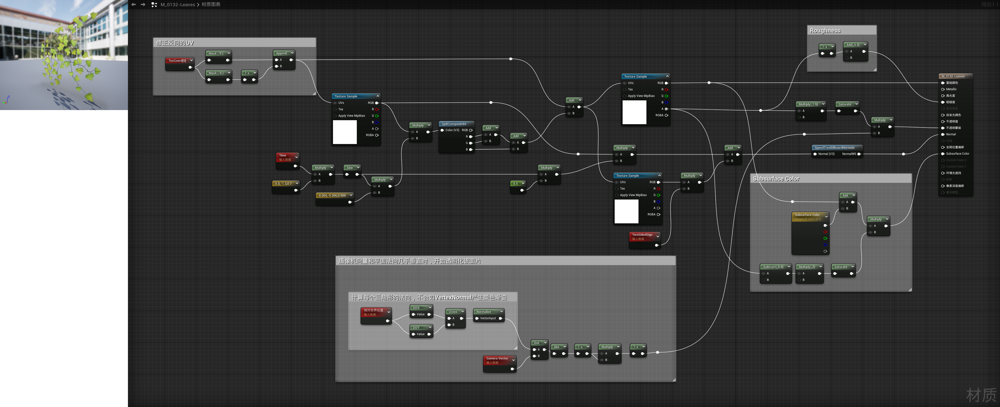

# 33 Foliage Normals 

[Link](https://www.youtube.com/watch?v=E_IiqijpfS0&list=PL78XDi0TS4lFlOVKsNC6LR4sCQhetKJqs&index=33)

通过调整法线使树叶面片不那么“面片”。

1. face normals

平面本身的朝向。

2. bent normals

可以在建模软件中将一个模型的法线烘焙到树叶的面片上。

3. object pivot normals

用树叶的世界坐标减去树的坐标，转换到切线空间，再与原法线混合。

可以获得很平滑的法线。

4. camera normals

将相机向量从世界空间转到切线空间。使得树叶的法线时刻根据观察的视角变化。

**这个彳亍。**

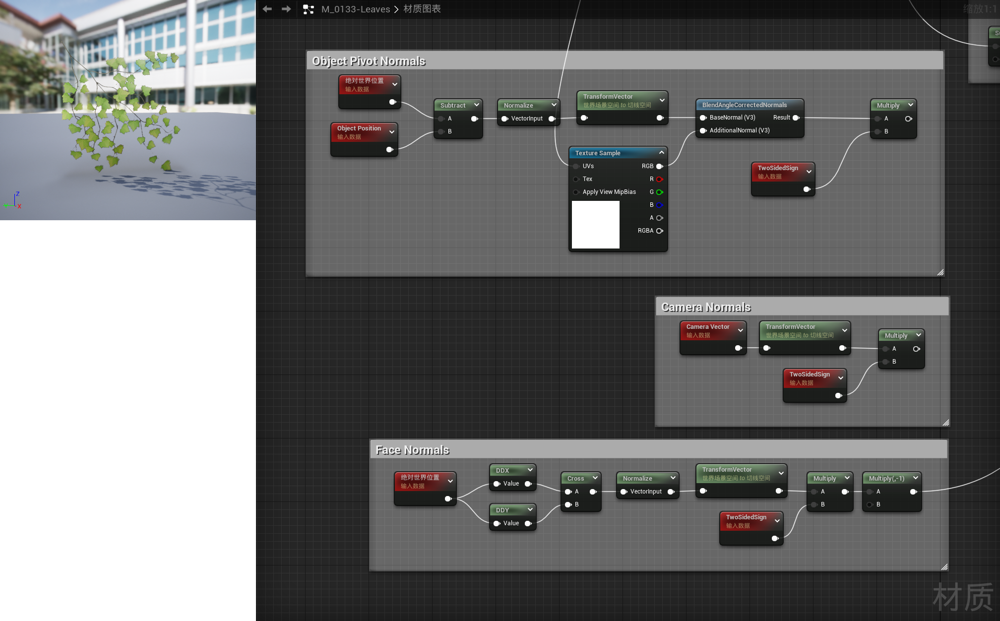

5. 混合法：Camera + Object Pivot

Camera应用到树枝；Object应用到叶子。

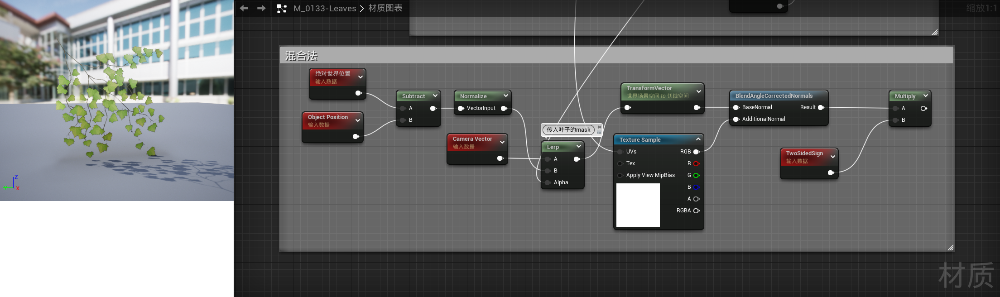

# 34 Foliage Ambient Occlusion

[Link](https://www.youtube.com/watch?v=CptpQ5vSy0U&list=PL78XDi0TS4lFlOVKsNC6LR4sCQhetKJqs&index=34)

树叶的AO，即中心处暗，外处亮。用树叶位置-物体位置，除树的高度制作一个由内向外逐渐变白的渐变。使得树叶更有体积感。

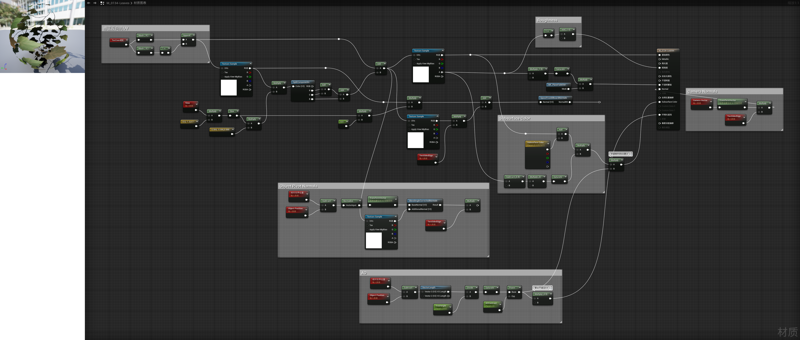

# 35 Foliage Camera Fade

[Link](https://www.youtube.com/watch?v=Lb-SVAPlzfk&list=PL78XDi0TS4lFlOVKsNC6LR4sCQhetKJqs&index=35)

摄像机靠近树叶时，它会淡出。写进一个函数中。

在shader中，将函数的输出连入DitherTAA，使用TAA让淡出更加自然（更吃性能）。

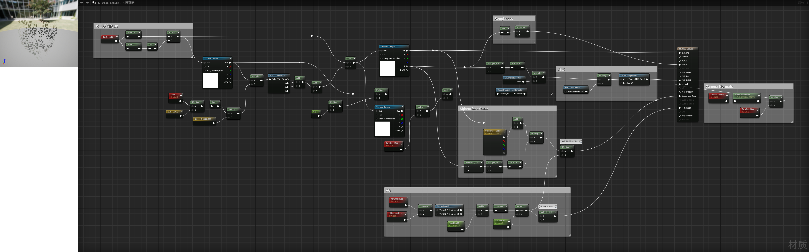

# 36 Foliage Color Variation

[Link](https://www.youtube.com/watch?v=7hJWd9ltkQw&list=PL78XDi0TS4lFlOVKsNC6LR4sCQhetKJqs&index=36)

如果世界中有很多很多的树，如何让它们的树叶自动发生颜色变化？

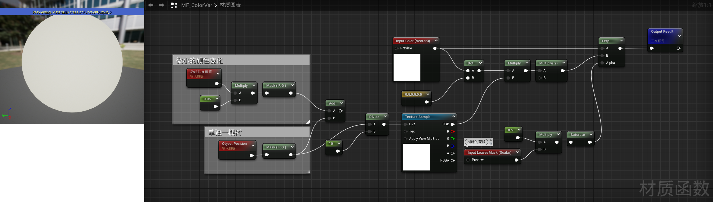

# 37 Foliage Wind Sway

[Link](https://www.youtube.com/watch?v=cBW3a0XVXsQ&list=PL78XDi0TS4lFlOVKsNC6LR4sCQhetKJqs&index=37)

SimpleGrassWind简单风效果 + RotateAboutAxis所有树叶一起摆动。

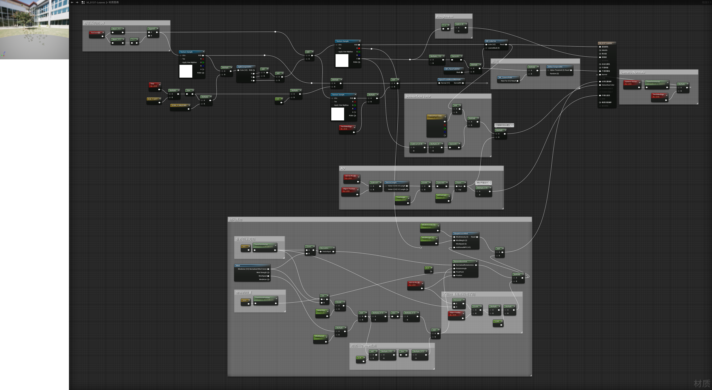